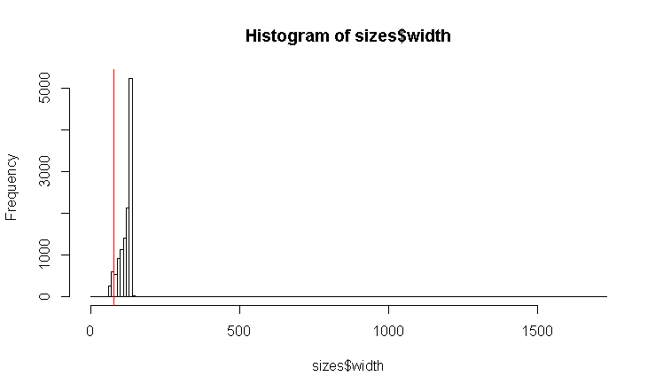

# SourceCodeRectAnalyzer
R script which analyzes for all files of the max number of char per lines per file and the max number of lines per file

## Purpose
This script will run through the source code files of a project and extract the max line length and the number of lines of each source code file.

## Environment

This is a R script which will work best with RStudio. If you do not use RStudio you will have to change the import path.

## Usage

1. Put the uncompressed source code files in the folder 'data'.
2. Adjust the file extension filter `allowedExtensions`.
3. Run the script in RStudio.

## Example Result

Elastic Search (2019-11-28):

| nr | file | width | height |
|----|------|-------|--------|
|1|elasticsearch-master/benchmarks/src/main/java/org/ elasticsearch/benchmark/fs/AvailableIndexFoldersBenchmark.java|97|94|
|2|elasticsearch-master/benchmarks/src/main/java/org/ elasticsearch/benchmark/indices/breaker/MemoryStatsBenchmark.java|91|105|
|3|elasticsearch-master/benchmarks/src/main/java/org/ elasticsearch/benchmark/routing/allocation/AllocationBenchmark.java|138|168|
|4|elasticsearch-master/benchmarks/src/main/java/org/ elasticsearch/benchmark/routing/allocation/Allocators.java|132|99|

Row 1-4 of 12195

The red line marks the classic 80 character per line limit